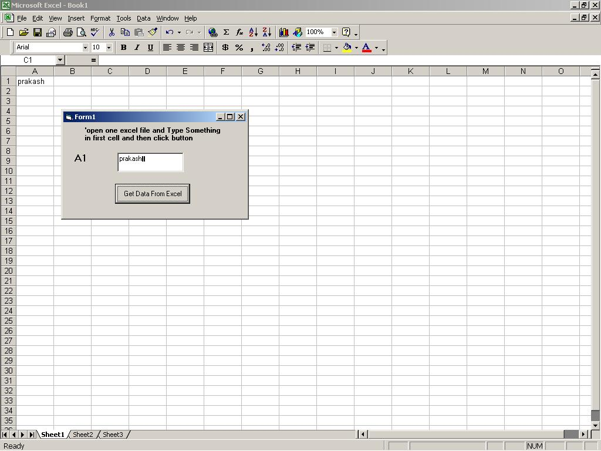



## DDE Example

### Description

Get Data from Excel on the Fly.
 
### More Info
 
'

----

'open one excel file and Type Something in first ccell

'

----

             |
---                |---
**Submitted On**   |2005-04-14 08:33:06
**By**             |[imprakashpatel](https://github.com/Planet-Source-Code/PSCIndex/blob/master/ByAuthor/imprakashpatel.md)
**Level**          |Advanced
**User Rating**    |3.7 (11 globes from 3 users)
**Compatibility**  |VB 6\.0
**Category**       |[Complete Applications](https://github.com/Planet-Source-Code/PSCIndex/blob/master/ByCategory/complete-applications__1-27.md)
**World**          |[Visual Basic](https://github.com/Planet-Source-Code/PSCIndex/blob/master/ByWorld/visual-basic.md)
**Archive File**   |[DDE\_Exampl1876574142005\.zip](https://github.com/Planet-Source-Code/imprakashpatel-dde-example__1-60006/archive/master.zip)

